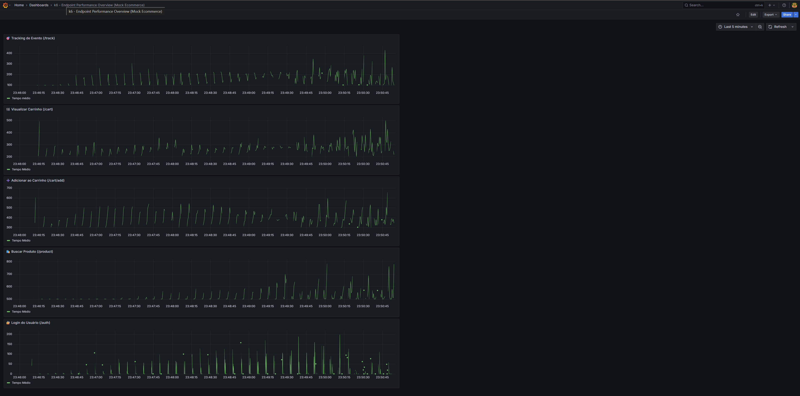
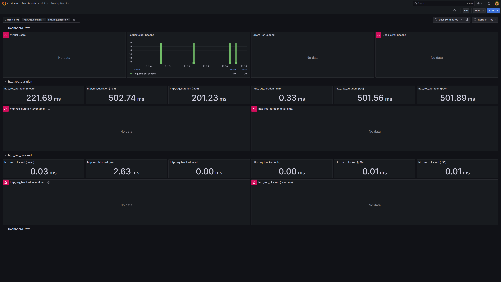

# 🛒 k6 Load Testing Ecommerce

Este projeto simula um fluxo completo de compra em um e-commerce e realiza testes de performance com [k6](https://k6.io/), enviando os resultados para o Grafana via InfluxDB.

---

## 🚀 Objetivo

Avaliar a performance de um fluxo crítico em sistemas de e-commerce:

1. Autenticação do usuário
2. Consulta de produtos
3. Adição de item ao carrinho
4. Rastreio do evento
5. Visualização final do carrinho

---

## 🧪 Tecnologias utilizadas

- [k6](https://k6.io/) — Load testing moderno e open source
- [Node.js](https://nodejs.org/) — Simulação do backend da aplicação
- [Docker Compose](https://docs.docker.com/compose/) — Ambiente InfluxDB + Grafana
- [InfluxDB](https://www.influxdata.com/) — Banco de séries temporais
- [Grafana](https://grafana.com/) — Visualização dos dados em tempo real

---

## 📁 Estrutura


```
mock-ecommerce/
├── tests/
│   └── flow\.test.js             # Script de teste com K6
├── mock-api/                    # Backend simulado com Node.js
│   ├── server.js
│   └── routes/
│       ├── auth.js
│       ├── cart.js
│       ├── product.js
│       └── track.js
├── docker/
│   └── docker-compose.yml       # InfluxDB + Grafana
├── data/
│   ├── products.json            # Dados mock para produtos
│   ├── dashboard-example.png    # Print geral do dashboard
│   └── dashboard-example2.png   # Dashboard por tags de endpoint
├── package.json
├── README.md

````

---

## 📊 Gráfico de tempo médio por endpoint

Com a ajuda do Grafana e do InfluxDB, o tempo médio de resposta de cada grupo foi separado por endpoint usando tags personalizadas.

📸 Exemplo:



---

## 🔄 Como os dados são enviados com tags

No script `flow.test.js`, cada request é anotada com uma `tag` personalizada indicando o nome do endpoint:

```js
http.get(`${BASE_URL}/product/abc123`, {
  tags: { endpoint: 'product' }
});
````

Essas tags são registradas automaticamente no InfluxDB e podem ser usadas em filtros no Grafana:

```sql
SELECT mean("value")
FROM "http_req_duration"
WHERE $timeFilter AND "endpoint" = 'product'
GROUP BY time($__interval)
```

---

## 🐳 Como subir tudo com Docker Compose

```bash
docker-compose -f docker/docker-compose.yml up -d
```

Isso irá subir automaticamente:

* InfluxDB na porta 8086
* Grafana na porta 3000

---

## 🧪 Como rodar os testes

```bash
k6 run tests/flow.test.js --out influxdb=http://localhost:8086/k6
```

> O k6 irá enviar os resultados direto para o InfluxDB, que será visualizado no Grafana.

---

## 📊 Acessando os resultados no Grafana

1. Acesse [http://localhost:3000](http://localhost:3000)
2. Login: `admin` / Senha: `admin`
3. Adicione o InfluxDB como datasource:

   * URL: `http://influxdb:8086`
   * Database: `k6`
4. Importe o dashboard (recomenda-se salvar o JSON do painel)
5. Ou crie painéis filtrando por `"endpoint"` conforme a tag enviada no teste

---

## 🖼️ Exemplos de Dashboards

### Geral



### Por endpoint com tags


---

## 🧩 Melhorias futuras

* Integração com banco real
* Mais cenários de carga (checkout, pagamento, etc)
* Geração de usuários com CSV
* Análise por rota com `tags` no k6
* Agrupamento e alertas automáticos no Grafana

---

## 👨‍💻 Autor

Feito com 💚 por **Marcus Vinicius Alexandre Barbosa**

🔗 GitHub: [@MarcvsAlexandre](https://github.com/MarcvsAlexandre)

🔗 LinkedIn: [Marcus Alexandre](https://www.linkedin.com/in/marcus-vinicius-alexandre-barbosa/)


---

## 📄 Licença

Este projeto é livre para estudos, testes e evolução.
